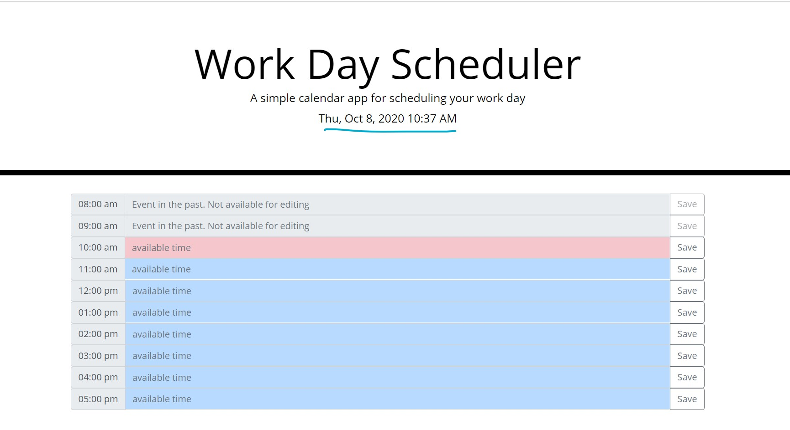
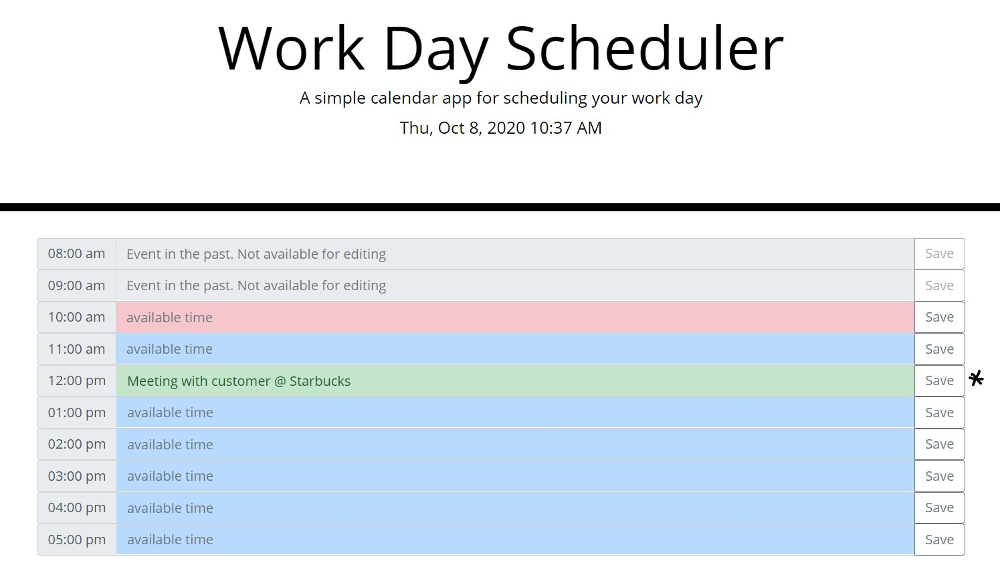
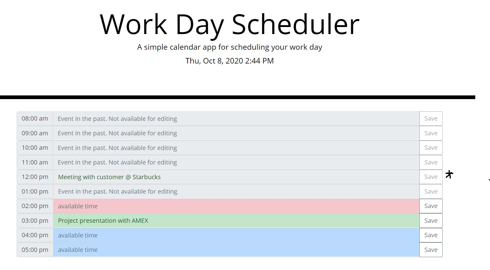
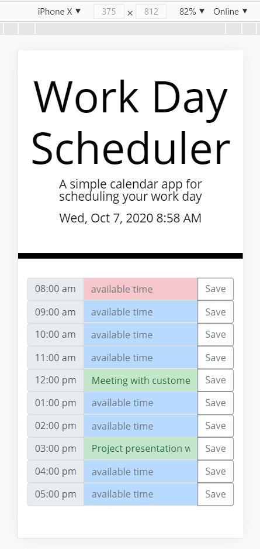
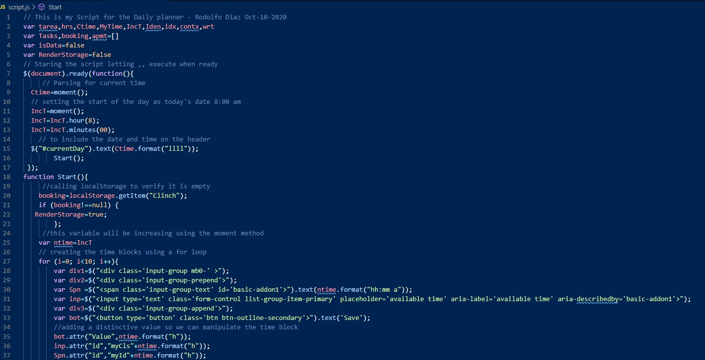
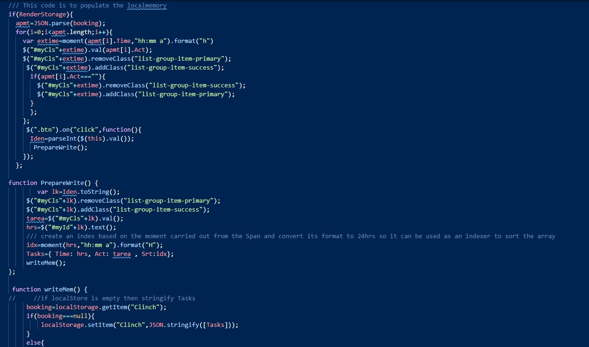

# Rodolfod1. Work day Scheduler
========================================
## My solution to a practical day scheduler 
### deployed application can be found at 
< https://rodolfod1.github.io/Work-Day-Scheduler/index.html>

## My approach to this project (Third party web API):
- My need to research and learn different techniques enabled me to think outside the box on this project.
- Moment.js was used extensively on this application as a personal touch on getting familiar and discover its potential; hence all block times are dynamically generated.
- Provided HTML was minimum touched just adding a reference div for jQuery to grab on. CSS was not touched and not used for any of the time blocks.
- Powered by Jquery all the CSS is generated and updated to comply with bootstrap 4.0 to give a responsive sense to the app, thinking on mobile first. 
- Time blocks are color coding to indicate actual time (red), future available time (blue), task booked successfully in the future (green), and events in the past on (gray) adding for this the attribute of "disabled" preventing the user to book events on the past. 
- Even when this application was required standard working time, my design can be customized up to 24hrs schedule, which comes handy if the user is working on global programs or/with different time zones. 
- All times are displayed on local time.   

## **  About the application **
* When the page loads:
  - The user is presented with a title of "Work Day Scheduler" and the Date and time when the application is launched.
  - If there is no historical data, a workday (8:00am to 5:00pm) will be displayed on time blocks.
  - Except for the events on the past, each time block can be selected and edited, the user must "save" the changes for it to take effect. 
  - If there is in fact historical data on the memory the application will load the information for the user to see it. 
  
    - This is an example of the page when it loads 
    

    - When the selects the time block and "clicks" the SAVE button, the row color changes its status and the localStorage is updated.
    - Here it is an example of this function:
     

    - As the day goes on and the application is refreshed all colors and attributes are updated:
    

* Mobile first approach:
 - Responsive application using bootstrap 4.0
    - Here is an example of the top three high scores on an iPhone X:
    

* To run the application:
  - This application runs as soon it is deployed
  - user needs to interact selecting the time blocks and saving them.
   

* When the quiz ends:
  - Once any of the conditions, either the questions OR the timer are depleted the user is prompted with a form which includes the score and a submission input for the scores to be recorded for further usage on the leaders board.

    - Image of the submission form:
        

* Style:
- Dynamically generated time blocks powered by jQuery designed using Bootstrap 4.0 a sober and bold style. 
 
 * About The CODE. 
  - Designed and Developed with jQuery keeping in mind it simplistic way to facilitate refactoring and debugging. 
  - Extensive use of Moment.js thru this application as a reinforcement exercise of the library (as personal touch).
  - Functions, LocalStorage, JSON , Objects and Events managers are deployed on this project. 
  
  

    - Example of moment.js and jQuery for this application.
     I

    - Example of the localStorage management:
    

  *This Project contents:
  - Index.html - hosting the web page application all information is updated dynamically from the js file .
  - Script.js - Code for executing the app. 
  - style.css - simple style for the application.
  - README.md - this file.  
 

  =================================================================================
  ### How to best use this 
   - please fork and clone this repository

  ### Special Note for Testing:
  - This application responds to moment.js, make sure to modify your computer clock to simulate a valid working time (8:00am to 5:00 pm).

 contact me at:
 https://github.com/Rodolfod1
 or direct email: rodolfodzr@gmail.com

 Rodolfo Diaz, Oct,10,2020
